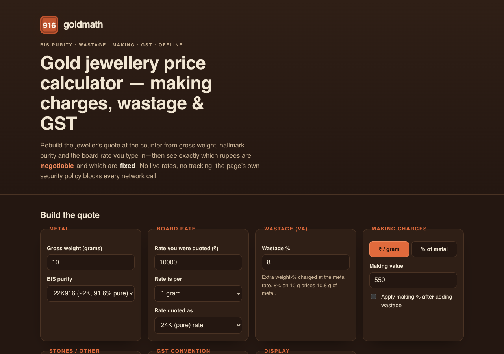

# goldmath

**Gold jewellery price calculator — making charges, wastage & GST.** Rebuild the jeweller's quote at the counter from gross weight, BIS hallmark purity and the board rate you type in — then see exactly which rupees are **negotiable** and which are **fixed**. 100% client-side, zero dependencies, works fully offline, and tells no one what you're pricing.

## Why

At the jeweller's counter you're handed a single total. Buried inside it are numbers that are effectively **fixed** — the metal value and GST — and numbers that are pure shop policy and therefore **negotiable** — the making charges and wastage. Most online "gold calculators" either fetch a live rate (which you can't verify against the board in front of you) or hide the split.

goldmath does the honest arithmetic. You enter what you see on the board, pick the hallmark purity, add the wastage and making the shop quoted, choose the GST convention your bill uses, and it rebuilds the total line by line — stamping each line **FIXED** or **NEGOTIABLE** and putting a big *"negotiable: ₹X (Y% of this quote)"* figure at the top. It also back-solves a bill you're handed, and shows the honest buy-back (melt) value — the reason making charges are money you never see again.

## Features

- **Quote builder** — gross weight, BIS purity picker (14K585 → 24K995), board rate with per-gram / per-10g / per-tola basis and 24K-vs-22K quoting, wastage %, making charges (₹/gram *or* % of metal, before/after wastage), and a flat stone/other pass-through field.
- **Fixed vs negotiable split** — the headline result. Every line is a debossed stamped chip marked FIXED (metal + GST) or NEGOTIABLE (making + wastage), with the negotiable rupee figure and its share of the quote up top.
- **Two GST conventions** — composite 3% on the full value, or split 3% on goods + 5% on separately-billed making. The active assumption is printed, never silent.
- **Verify mode** — type the total from a shop's bill and goldmath back-solves the implied making charge: the number to open your haggle with.
- **Buy-back / melt value** — net weight × fineness × rate minus a deduction you set, excluding making, wastage and GST. A reference ceiling, clearly labelled.
- **Compare two shops** — set Quote A and Quote B and see which shop's making + wastage is higher, and by how much.
- **Saved quotes** — name, save, load, and duplicate quotes in your browser's localStorage.
- **Cited reference card** — every constant the maths uses (BIS purity grades, GST rates, the tola) is shown with its source and verified-on date.
- **Export** — print / print-to-PDF stylesheet and a copy-to-clipboard text summary.
- **100% offline** — no accounts, no network calls, no tracking. Nothing about what you're pricing ever leaves your device.

## Quickstart

Just open `index.html` in any modern browser — no build step, no server, no install.

- **Local:** double-click `index.html`, or run a static server in the folder.
- **Hosted:** **[Open goldmath live](https://sreenivas-sadhu-prabhakara.github.io/goldmath/)**

Saved quotes and comparisons live in your browser's local storage and persist between visits.

## The maths (and how it's verified)

- All money is computed in **integer paise** — never floating-point rupees — and formatted for display only, with Indian lakh/crore grouping (and a plain 1,000-grouping toggle).
- Metal value uses the **stamped BIS fineness** (e.g. 916/1000), not karat/24 (916.67/1000), so it is a slightly conservative, honest estimate.
- Every constant in `data/facts.js` (the six BIS purity grades, the 3%/5% GST rates, 1 tola = 11.6638 g) carries provenance and is read by the engine — never duplicated. The Node test suite (`node --test`) re-derives every formula and asserts the worked fixtures to the paisa, including the adversarially-reviewed 24K995 purity edge case. See `sources/CITATIONS.md`.

## Privacy

goldmath is built so it *cannot* leak what you're pricing.

- A strict Content-Security-Policy sets `connect-src 'none'`: the app **cannot** make any network request even if it tried. No live gold rate is ever fetched — you type the rate from the board.
- No external fonts, scripts, images, or analytics. Everything is self-contained.
- All logic runs in your browser; saved quotes stay in your device's local storage. Clearing site data deletes them — use the copy/print export to keep a record.

## Disclaimer

goldmath is a **negotiation reference, not financial, investment, or tax advice.** Billing conventions vary by shop, region and state; the toggles cover the common structures, but if your bill is built differently, compare it line by line rather than trusting the total. GST figures are **as of 2026-07-22** (cited in the in-app reference card) — verify the rates printed on your actual invoice. Hallmarked fineness is a certified *minimum*, so metal value is a slightly conservative estimate. Buy-back and exchange values are shop policy, not law; the melt value shown is a reference ceiling and real offers deduct more. This software is provided under the MIT License, "as is", without warranty of any kind; the author accepts no liability for any loss arising from its use.

## License

[MIT](./LICENSE) © 2026 Sreenivas Sadhu Prabhakara
